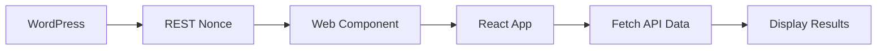

# Shadow Plugin Boilerplate

A modern WordPress plugin boilerplate featuring **React 18**, **Shadow DOM isolation**, and **REST API integration**. Built with production-ready architecture, modular components, and the beautiful **Raycast design system**.

https://github.com/user-attachments/assets/ae7c0d35-d6e6-4f83-9087-8c8d2c0ae0e0

## ✨ Key Features

- 🎯 **React 18** with modern hooks and components
- 🔒 **Shadow DOM** for complete style isolation from WordPress themes
- 🌐 **REST API Integration** with authenticated requests
- 🎨 **Raycast Design System** with CSS variables and semantic tokens
- ⚡ **Vite Build System** for lightning-fast development
- 🧩 **Modular Architecture** with clean separation of concerns
- ⌨️ **Keyboard Shortcuts** (`Cmd/Ctrl + K` to toggle)
- 📦 **Web Components** using @r2wc/react-to-web-component
- 🎭 **Framer Motion** animations and smooth transitions
- 📱 **Responsive Design** that works on all devices

## 🚀 Quick Start

### Prerequisites
- **WordPress 5.8+**
- **Node.js 18+**
- **Pretty Permalinks enabled** (see troubleshooting below)

### Installation

```bash
# 1. Clone or copy the boilerplate
git clone <repo-url> your-plugin-name
cd your-plugin-name

# 2. Install dependencies
npm install
# or
pnpm install

# 3. Build the plugin
npm run build

# 4. Activate in WordPress Admin → Plugins
```

### ⚠️ **Important: Enable Pretty Permalinks**

**Before testing, you MUST enable pretty permalinks:**

1. Go to **WordPress Admin → Settings → Permalinks**
2. Select **"Post name"** or any option except "Plain"
3. Click **"Save Changes"**

*Why? WordPress REST API requires pretty permalinks to function.*

### 🧪 Test the Plugin

1. **Visit any WordPress admin page**
2. **Press `Cmd/Ctrl + K`** to open the command palette
3. **See real data** fetched from WordPress REST API
4. **If you see JSON errors** → Check permalinks are enabled

## 🏗️ Architecture Overview

### Modern File Structure

```
shadow-plugin/
├── src/                          # React source files
│   ├── components/              # Modular React components
│   │   ├── CommandPalette.jsx   # Main command interface
│   │   ├── SearchInput.jsx      # Search with icon
│   │   ├── CommandItem.jsx      # Individual list items
│   │   └── TriggerButton.jsx    # Floating trigger
│   ├── ShadowApp.jsx           # Main React application
│   ├── ShadowStyles.jsx        # CSS-in-JS with variables
│   └── main.jsx                # Web component entry point
├── api/                         # REST API endpoints
│   ├── class-user-endpoint.php  # User data API
│   └── class-site-endpoint.php  # Site information API
├── inc/                         # PHP classes
│   ├── class-admin.php         # Admin functionality
│   ├── class-assets.php        # Asset management
│   └── class-api.php           # API registration
├── shadow-plugin.php           # Main plugin file
├── STYLEGUIDE.md              # Design system reference
├── CLAUDE.md                  # LLM development guide
└── repo_assets/               # Documentation assets
    └── startup.mp4            # Demo video
```

### Clean Data Flow



**Key Principle:** Only pass the **REST nonce** as a prop, fetch everything else via API.

## 🔧 Development Commands

```bash
# Development with hot reload
npm run dev

# Production build
npm run build

# Build and watch for changes
npm run build:watch

# Preview built files
npm run preview
```

## 🎨 Design System

The plugin includes a complete **Raycast-inspired design system** with:

### CSS Variables (LLM-Friendly)
```css
/* Background Colors */
--surface: rgba(24, 24, 27, 0.95)        /* Main containers */
--surface-hover: rgba(39, 39, 42, 0.95)  /* Interactive states */
--surface-bg: rgba(9, 9, 11, 0.95)       /* Page backgrounds */

/* Text Colors */
--text-primary: rgba(255, 255, 255, 0.98)   /* Headings */
--text-secondary: rgba(255, 255, 255, 0.7)  /* Body text */
--text-tertiary: rgba(255, 255, 255, 0.5)   /* Subtle text */
```

### Component Examples
```jsx
// Button with design system
<button style={{
  backgroundColor: 'var(--surface)',
  color: 'var(--text-primary)',
  border: '1px solid var(--border)'
}}>
  Click me
</button>

// Input field
<input style={{
  backgroundColor: 'transparent',
  color: 'var(--text-primary)',
  border: '1px solid var(--border)'
}} />
```

See **[STYLEGUIDE.md](STYLEGUIDE.md)** for complete reference.

## 🌐 REST API Integration

### Available Endpoints

```bash
# Test API is working
GET /wp-json/shadow-plugin/v1/status

# Get current user data (requires auth)
GET /wp-json/shadow-plugin/v1/user

# Get site information (requires auth)
GET /wp-json/shadow-plugin/v1/site
```

### Example Usage in React

```jsx
// Fetch user data with nonce authentication
const response = await fetch('/wp-json/shadow-plugin/v1/user', {
  headers: {
    'X-WP-Nonce': restNonce  // Passed as web component prop
  }
});
const userData = await response.json();
```

### Adding New Endpoints

1. **Create endpoint class** in `api/` directory
2. **Register in** `inc/class-api.php`
3. **Add nonce verification** for security
4. **Return JSON responses** with proper error handling

## 🧩 Component Architecture

### Web Component Integration

```javascript
// main.jsx - Web component definition
const ShadowPluginElement = r2wc(ShadowApp, {
  shadow: 'open',
  props: {
    restNonce: 'string'  // Only prop needed
  }
});
```

### PHP to React Data Flow

```php
<!-- PHP: Pass only REST nonce -->
<shadow-plugin-panel rest-nonce="<?php echo wp_create_nonce('wp_rest'); ?>">

<!-- Converted to React prop -->
function ShadowApp({ restNonce }) {
  // Use nonce to fetch all data via API
}
```

### Adding New Components

1. **Create in** `src/components/`
2. **Import in** parent component
3. **Follow CSS variable patterns**
4. **Add to STYLEGUIDE.md** if reusable

## 🔒 Security Features

- ✅ **WordPress REST nonces** for API authentication
- ✅ **Permission callbacks** on all endpoints  
- ✅ **Input sanitization** with `esc_attr()`, `esc_js()`
- ✅ **Shadow DOM isolation** prevents XSS via CSS
- ✅ **Logged-in user requirements** for sensitive data

## 📋 What's Included

### ✅ **Completed Features**
- [x] React 18 with Shadow DOM architecture
- [x] Raycast design system with CSS variables
- [x] REST API endpoints for user and site data
- [x] Modular PHP class structure
- [x] Web component with proper prop passing
- [x] Keyboard shortcuts and animations
- [x] Loading states and error handling
- [x] LLM-friendly documentation and code patterns

### 🎯 **Perfect for Building**
- **Admin interfaces** with WordPress data
- **Frontend widgets** with style isolation
- **Command palettes** and search interfaces
- **Settings panels** with real-time data
- **Dashboard components** with API integration

## 🔧 Troubleshooting

### "API Error: JSON.parse" when plugin loads

**Most Common Issue:** WordPress REST API not working

**Solution:**
1. **Enable Pretty Permalinks**: WordPress Admin → Settings → Permalinks
2. Select **"Post name"** or any option except "Plain"
3. Click **"Save Changes"**
4. Refresh and test again

### Plugin shows "No REST nonce provided"

**Cause:** Web component attributes not passing correctly

**Solution:**
1. Check browser console for JavaScript errors
2. Verify plugin JS is loading: `/wp-content/plugins/shadow-plugin/dist/js/shadow-plugin.js`
3. Rebuild: `npm run build`

### Command palette doesn't open

**Solution:**
1. Press `F12` → Console tab for errors
2. Try `Cmd/Ctrl + K` (not backtick)
3. Click the "Open Command Palette" button
4. Check for plugin conflicts

### API endpoints return 404

**Solution:**
1. WordPress Admin → Settings → Permalinks
2. Click **"Save Changes"** (flushes rewrite rules)
3. Test directly: `/wp-json/shadow-plugin/v1/status`

## 📚 Additional Documentation

- **[STYLEGUIDE.md](STYLEGUIDE.md)** - Complete design system reference for LLMs
- **[CLAUDE.md](CLAUDE.md)** - Development guide for AI assistants

## 🤝 Contributing

This boilerplate demonstrates modern WordPress plugin development with:
- Clean, modular architecture
- LLM-friendly code patterns
- Production-ready security
- Comprehensive documentation

## 📄 License

GPL v2 or later - Perfect for WordPress plugin development

## 👨‍💻 Author

**Daniel Snell @Umbral.ai**

---

**🚀 Ready to build modern WordPress plugins with React?**

This boilerplate gives you everything you need with clean architecture, security best practices, and beautiful design. The demo shows it works - now make it yours!